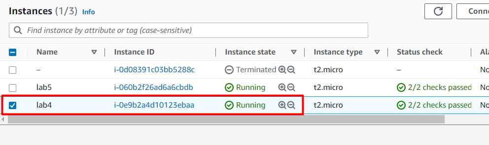

# lab4
1. Встановив Terraform і створив сценарій терраформу

provider "aws" {
  access_key = "here was my acces key"
  secret_key = "here was my secret key"
  region = "eu-central-1"
}
resource "aws_instance" "ubuntuinst" {
    ami = "ami-0caef02b518350c8b"
    instance_type = "t2.micro"
    key_name = "key_aws_frankfurt"
    vpc_security_group_ids = [aws_security_group.ubuntuinst.id]
    user_data = <<E0F
#!/bin/bash
sudo apt update -y
sudo apt install apache2 -y
E0F
  
}

resource "aws_security_group" "ubuntuinst" {
    name = "ubuntuinst_security_group"
    description = "none"

    ingress {
        from_port = 80
        to_port = 80
        protocol = "tcp"
        cidr_blocks = ["0.0.0.0/0"]
    }

    ingress {
        from_port = 443
        to_port = 443
        protocol = "tcp"
        cidr_blocks = ["0.0.0.0/0"]
    }

    ingress {
        from_port   = 22
        to_port     = 22
        protocol    = "tcp"
        cidr_blocks = ["0.0.0.0/0"]
    } 

    egress {
        from_port = 0
        to_port = 0
        protocol = "-1"
        cidr_blocks = ["0.0.0.0/0"]
    }
}

resource "aws_key_pair" "deployer" {
  key_name   = "key_aws_frankfurt"
  public_key = "ssh-rsa AAAAB3NzaC1yc2EAAAADAQABAAABgQDSARHLRGOfr/KIeHxnbZGbnehx28ZcF9pzvz4kIfapGymk6rKArgr0eeIlaevytanei8XAEO7DU6oUhgFNU20M8wS5zxZskzXm+NT2t1+W6NASE2PbDmZnZn7dkfQLBXheKNQlFUecencFomdJdr5mGF59bCRFYHDKAR78cmV3vnoF/MbtgPLeHdttKqPqrXhEWlWRrkYMhiR8T1Vdnf2/Uj4yQlIIDFuHM7ruBtX8nFTQraSn3+WafG6tEbFm1vrJGkGDM15+RWXY1/YxjUz4ag6JrMAVoi4se/Z7gGAnXbcp2E4cWnZ4KubnhVpMQ4MXhbxqQD/M4asPkLW0plCPZdaQmeUSC7tprWt5svVwaqYqwaRSqfDNehccTvJeIj8vWfnbak2CgsjanPtPzwhxWol/fEy2IhsqIYpcYVN3ObW7mQNlpg7gH/RtOsLatoq52OFGbw1cBCB1MaaTAgGGFvffT7CMceBTybgMQ3cA9t110m3pU2pa0TtdIV3kPTs="
}

2. Задопомогою команди terraform init i terraform apply створив інстанс на AWS.

3. І запустив сервер Apache.

