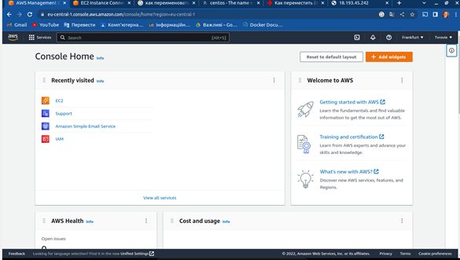
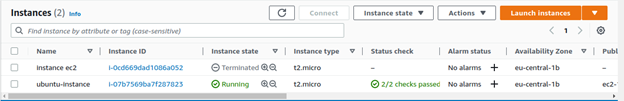
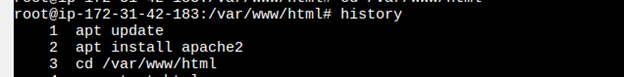
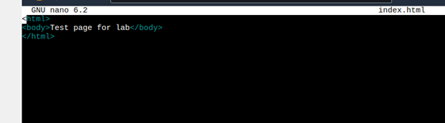
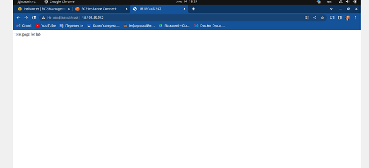

# lab5

1.	Зареєструватися на AWS

2.	Створити екземпляр EC2

 
*перший інстанс я створював на Amazon linux і в мене з ним були про-блеми, тому я створював повторно на убунту 20.04

3.	Задеплоїти проект і скинути посилання в звіт для можливості перегляду.

 
Встановив Apache та перейшов в директорію /var/www/html

 
Через nano відредагував index.html

 
І відкрив сторінку в браузері http://18.184.80.220/
