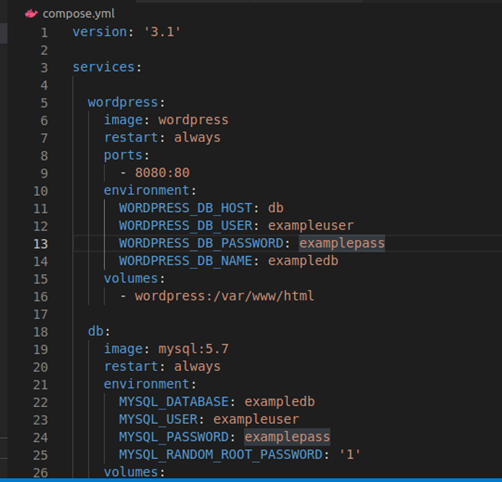

# lab3
1.	Використання готових Docker Images
Створюю файл compose.yml в якому записую всі залежності за інстукцією для wordpress з Docker Hub

І переношу це в compose.yml

Далі запускаю команду docker-compose up -d з папки з файлом

 
І створюю сторінку за безкоштовним шаблоном

2.	Використання Docker Compose
Docker Compose — інструментальний засіб, що входить до складу Docker. Воно призначене для вирішення завдань, пов'язаних із розгортанням проектів. Під час роботи в Compose ви використовуєте файл YAML для налаштування служб програми. Потім ви створюєте та запускаєте всі служби з конфігурації шляхом виконання однієї команди.
3.	Створення HTML сторінки та занесення її в Docker Image
Створити HTML сторінку із ПІБ, групою та номером лаб. роботи:

Створити Docker Image із цією сторінкою.
Реалізувати можливість запуску цієї сторінки з контейнера:

Створюю Docker image :

Перевірити на працездатність контейнера на основі вашого образу:

Залити готовий образ на Docker Hub:
https://hub.docker.com/u/19jem

4.	Скачати Docker Image когось із групи і розвернути в себе контейнер з HTML сторінкою на порті 8086 ззовні
"Пуллю" docker image Артема Магея і запускаю на порті 8086

