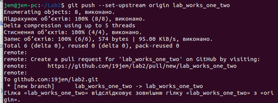

# lab2
1.	Зробити скріншот пройдених рівнів

  

2.	Зробити git init папки із файлом hello.txt та bash-скриптом

 

3.	Зробити git commit

 

4.	Зробити git push у віддалений репозиторій у вітку lab_works_one_two

 

 
 
 

5.	Додати у файл Readme звіт до лабораторної роботи, щоб його можна було переглянути на репозиторію коли переходиш у вітку
Висновок: на даній лабораторній роботі я навчився використовувати основні команди Git і «пушити» у віддалений репозиторій.
